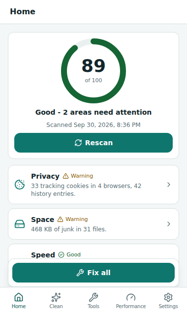
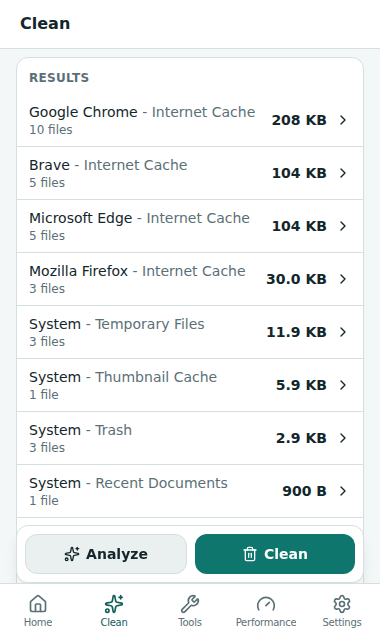
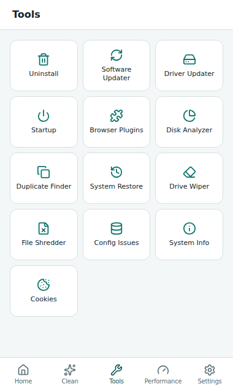
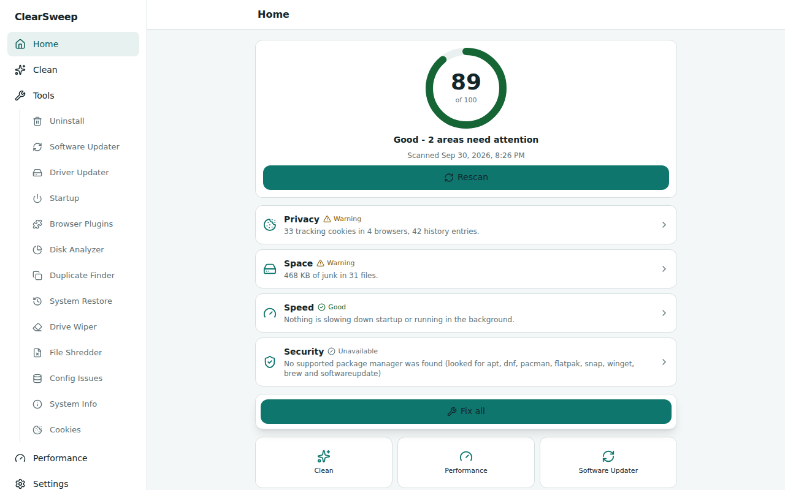

# ClearSweep

ClearSweep is a free, open-source system cleaner and optimizer for Linux, Windows and macOS. It removes junk files and browser traces, manages startup items, browser extensions, installed programs and updates, analyzes disk usage, finds duplicate files and can securely erase data. Every feature is available to everyone: there is no account, no payment, no advertising and no telemetry. The application code contains no HTTP client; the only network traffic comes from the package managers that the updaters run on your behalf (`apt`, `winget`, `brew`, ...).

It runs either as a desktop app (a small Tauri window with a tray icon) or in your browser against a local, token-protected server (`clearsweep ui`). A headless command line covers scripting and scheduled cleaning.

<table>
  <tr>
    <td align="center"><br><sub>Home: Health Check</sub></td>
    <td align="center"><br><sub>Clean: analyzed</sub></td>
    <td align="center"><br><sub>Tools</sub></td>
  </tr>
</table>

<p align="center"><br><sub>Wide layout (window of 900 px or more)</sub></p>

More screenshots, with captions, are listed in [docs/screenshots/INDEX.md](docs/screenshots/INDEX.md).

> Status: everything is exercised end to end on Linux. The Windows and macOS code paths compile and are unit-tested against mocks, but have not yet been run on real Windows or macOS machines. See [Platform status and limitations](#platform-status-and-limitations).

## Contents

- [Features](#features)
- [Opening the app](#opening-the-app)
- [Safety model](#safety-model)
- [Building from source](#building-from-source)
- [Development and testing](#development-and-testing)
- [Architecture](#architecture)
- [Platform status and limitations](#platform-status-and-limitations)
- [License](#license)

## Features

The app has five tabs (Home, Clean, Tools, Performance, Settings). "Yes" in the OS columns means the feature is implemented for that OS in the code; see [Platform status](#platform-status-and-limitations) for what has actually been run.

| Feature | What it does | Linux | Windows | macOS |
| --- | --- | --- | --- | --- |
| Health Check (Home) | One scan with a 0-100 score over four categories: privacy, space, speed, security (pending updates). "Fix" does only what you reviewed. | Yes | Yes | Yes |
| Custom Clean (Clean) | Rule-driven analysis and removal of temp files, caches, logs, trash and browser data for 7 browsers, plus apps and developer tools. Keeps a history of past cleans. Rules are declarative TOML; see [the rule format](crates/sweep-core/src/features/cleaner/rules/README.md). | 77 rules | 81 rules | 76 rules |
| Cookies to keep (Tools > Cookies) | Lists cookies by site across all browser profiles, keeps a list of sites whose cookies survive cleaning, can add common sites automatically ("intelligent scan") and can delete chosen sites' cookies. | Yes | Yes | Yes |
| Include / Exclude (Settings) | Include: extra folders (with a file mask, optional recursion and empty-folder removal) that Clean also handles. Exclude: paths or globs that are never touched. | Yes | Yes | Yes |
| Secure deletion + File Shredder | Overwrite files before deleting, with 1, 3 (DoD 5220.22-M), 7 or 35 (Gutmann) passes. A setting applies it to Clean; the File Shredder (Tools) shreds files and folders you name. | Yes | Yes | Yes |
| Registry Cleaner / Config Issues (Tools) | Finds broken settings and repairs them after a mandatory backup. | Config Issues: launchers, autostart entries, dangling links, `mimeapps.list`, user services, orphaned packages | Registry Cleaner: 15 registry categories | Config Issues: launch agents, dangling links |
| Uninstall (+ leftovers) | Lists installed programs, uninstalls through the platform's own tool, then finds leftover data folders to remove. | dpkg, rpm, pacman, Flatpak, Snap, AppImage, Homebrew | Uninstall registry entries (also repair, rename, remove entry) | `.app` bundles, Homebrew |
| Software Updater | Lists and installs updates through the package managers found on the system; individual updates can be ignored. | apt, dnf, pacman, Flatpak, Snap, Homebrew | winget | Homebrew, `softwareupdate` |
| Driver Updater | Finds and installs firmware/driver updates. | `fwupdmgr` firmware; recommended `ubuntu-drivers` package | Windows Update drivers, with a driver backup first | Firmware items from `softwareupdate -l` |
| Performance Optimizer (Performance) | "Sleep mode": disables the startup items of a background app and asks its processes to quit; wake restores exactly what sleep changed. | Yes | Yes | Yes |
| Startup manager (Tools) | Lists, switches on/off and removes startup items, with an impact grade. Critical items are refused. | Autostart entries, systemd units, cron `@reboot` | Run keys, services, scheduled tasks, context-menu handlers | Launch agents/daemons, login items |
| Browser Plugins (Tools) | Lists extensions, themes, apps and dictionaries per profile of Chrome, Chromium, Edge, Brave, Opera, Vivaldi and Firefox; disable, enable or remove them. | Yes | Yes | Yes |
| Disk Analyzer (Tools) | Space by file type, biggest folders and files, delete from the results. | Yes | Yes | Yes |
| Duplicate Finder (Tools) | Groups identical files (match by name, size, modified time and/or content), auto-select rules, CSV/TXT export. Never removes the last copy. | Yes | Yes | Yes |
| System Restore (Tools) | Lists, creates and deletes OS restore points, and restores ClearSweep's own backups. | Timeshift, Snapper | Windows restore points | Time Machine local snapshots |
| Drive Wiper (Tools) | Overwrites the free space of a volume (1/3/7/35 passes). | Free space and whole physical drives | Free space only | Free space only |
| Smart Cleaning (Settings) | Background junk check against a size threshold (default 500 MB) with notification, optional automatic clean, and clean-after-browser-closes. | Yes | Yes | Yes |
| Scheduled cleaning (Settings > Schedules) | Hourly, daily, weekly, monthly or on-login cleans that run even when ClearSweep is closed. | systemd user timers, else cron | Task Scheduler (`schtasks`) | launchd agents |
| Run at startup / background agent (Settings) | Launches the headless agent at login (smart cleaning, sleep-mode enforcement, catch-up of missed schedules). | XDG autostart entry | `HKCU\...\Run` value | LaunchAgent |
| System Info (Tools) | OS, CPU, memory, disks and uptime. | Yes | Yes | Yes |
| Settings | Theme (System / Light / Dark), compact mode (forces the phone-width layout on wide windows), close to tray, what to do about running browsers (ask / close / skip), minimum age of temp files, language (English only). | Yes | Yes | Yes |

Notes:

- Rule counts come from the rule files in `crates/sweep-core/src/features/cleaner/rules/` (102 rule definitions in total; the 49 browser rules apply on every OS).
- The UI is English only.
- Whole-drive wiping is offered in the UI on Linux only. Free-space wiping does not fill file-system metadata (inodes / MFT records).

## Opening the app

### Desktop app

Start the desktop executable (`clearsweep-desktop`, or the installed "ClearSweep" app). It opens a window of 380 x 640 px (minimum 320 x 560, resizable). From about 900 px of width the layout switches to a navigation rail with a content column; Settings > Compact mode keeps the phone layout.

- A tray icon offers: Open ClearSweep, Health Check, Clean now, Smart Cleaning (toggle), Quit. A left click on the icon shows the window.
- The close button hides the window to the tray when a tray icon exists and "Close to tray" (on by default) is enabled; "Quit" in the tray menu exits.
- `--hidden` starts minimized to the tray.
- While the app is open, the background agent runs inside it unless another agent (for example the autostarted one) already holds the lock.
- With no display or WebView available (for example no `DISPLAY` / `WAYLAND_DISPLAY` on Linux), the app falls back to browser mode. `--browser` or `CLEARSWEEP_BROWSER=1` forces browser mode.

### Browser mode

```sh
clearsweep ui
```

prints `ClearSweep running at http://127.0.0.1:<port>/?t=<token>` and opens it in your default browser.

- The server listens on `127.0.0.1` only. Every request must carry the per-launch token (32 random bytes, hex); the token is taken from `?t=` once and removed from the address bar. A tab opened without the private link shows an "open from link" page. The `Host` header must be a loopback name with the server's port (DNS-rebinding defence) and a present `Origin` must be the server's own.
- Each open tab sends a heartbeat every 5 s. When heartbeats have been received and then stop for 90 s (the last tab was closed), the server exits. Ctrl-C also stops it.

| Flag | Effect |
| --- | --- |
| `--port <PORT>` | Port to listen on; `0` (default) picks a free port. |
| `--no-open` | Do not open a browser window. |
| `--no-exit-on-idle` | Keep running after the last tab closes. |
| `--print-url` | Also print the bare URL on its own line. |

### Headless command line

The `clearsweep` binary (from `sweep-cli`) and the desktop executable both understand `clean`, `analyze`, `agent` and `call`, and never open a window for them. OS schedulers and autostart entries launch these. `ui` belongs to the `clearsweep` binary only. On Windows, release builds of the desktop executable have no console, so use `clearsweep` when you want to see output.

```sh
# What would a clean remove? Read-only.
clearsweep analyze [--rules <ID,ID,...>] [--json]

# Clean with the saved settings, without prompting. --auto is required.
clearsweep clean --auto [--rules <ID,ID,...>] [--source auto|scheduled] [--schedule <ID>] [--json]

# Run the background agent (exits at once if another agent is running).
clearsweep agent [--once]

# Call any API method in-process and print the JSON result.
clearsweep call <METHOD> [<JSON-PARAMS>]
```

- `--rules` takes rule ids such as `chrome.cache` or `linux.temp`; the default is the rules enabled in Settings. `clearsweep call cleaner.list_rules` lists the ids available on this system.
- `clean --schedule <ID>` runs a saved schedule and records its result; this is what the OS scheduler runs, as `clean --auto --source scheduled --schedule <id>`. It cannot be combined with `--rules`. A disabled schedule does nothing.
- Interactive cleaning is done in the app. A headless clean has no review step, so run `analyze` first. A running browser that Settings says to "ask" about is skipped, because nobody can answer.
- `agent --once` runs every task once and exits (for troubleshooting).
- `call` examples: `clearsweep call sysinfo.get`, `clearsweep call cleaner.analyze '{"ruleIds":["linux.temp"]}'`.

## Safety model

- Analyze before clean. The Clean page only enables Clean after an Analyze of the current selection (changing the selection requires analyzing again) and asks for confirmation. Health Check "Fix" does only the parts you selected.
- The UI never sends paths to delete. `cleaner.clean` re-scans on the server and deletes what its own rules find. For everything else the client sends ids that only select: startup items, updates, uninstall entries, registry/config issues and driver updates are looked up again in a fresh server-side scan or listing; Disk Analyzer and Duplicate Finder deletes only accept files that are in the scan's results (Disk Analyzer also requires them to be unchanged since).
- Protected paths are never deleted: filesystem roots, your home folder, Desktop, Documents, Downloads, Pictures, Music, Videos, Movies, Public and Library, `~/.ssh`, `~/.gnupg`, ClearSweep's own data folder and the operating-system folders of each platform (for example `/usr`, `/etc`, `C:\Windows`, `/System`). User-defined include folders may not be inside OS folders or be an application-data root. The File Shredder refuses the same paths.
- Symlinks are never followed. Directory walks do not follow links or cross file systems, and a symlink is removed as a link.
- Temp files in use are never touched. A temp file counts as old only when its modification, access and status-change times are all older than the age setting; a top-level temp folder is skipped entirely if anything inside it is recent or open by a running process (Linux reads `/proc` for open, mapped and working-directory files).
- The exclude list is honored by every delete. An invalid exclude pattern makes the operation fail instead of being ignored.
- Backups before changes. Registry and configuration fixes are preceded by a mandatory backup, and any backup failure aborts the fix before a single change. Removing a startup item, removing a browser add-on, removing or renaming a Windows uninstall entry and installing Windows drivers are backed up first too. Backups live in `backups/` in ClearSweep's data folder (Settings > About > open data folder).
- Restoring. Tools > System Restore lists ClearSweep's own backups next to the OS restore points and can restore registry backups, configuration backups, Windows uninstall-entry backups and Windows driver backups; the Registry / Config Issues page has a Backups view as well. A removed startup item or browser add-on can be put back from System Restore ("Removed startup item: <name>", "Removed browser add-on: <name> (<browser>)"), and the Startup and Browser Plugins pages show an Undo button right after a delete or removal (the same actions exist as `startup.restore_backup` and `browser_plugins.restore_backup`). Restoring never overwrites: a startup file, cron line, extension folder or `.xpi` that already exists again is left as it is (the startup page says so; the add-on restore is refused with a message). An add-on is only restored into the browser profile it came from, which must still exist, and only while that browser is closed; its own entries in `Preferences` (Chromium) or `extensions.json` and `addonStartup.json.lz4` (Firefox) are merged back and everything else in those files is kept. A Chromium extension that was registered in the integrity-protected `Secure Preferences` comes back as files only (the browser may not pick it up again; re-add it from the browser's extensions page), and add-on backups made by earlier versions did not record their profile, so they are listed but cannot be restored. Switching an add-on on or off also keeps a backup, but that is not offered for restore. OS-level rollback (Windows System Restore, Timeshift, Snapper, Time Machine) is done with that tool; ClearSweep can open it where there is one.
- Running-app detection. Rules name the processes of their application. By default ("Ask me") a running application is skipped and reported; "Close them automatically" asks the app to quit and waits. Nothing is ever force-killed.
- Elevation only when needed. Package managers, driver installs, machine-wide uninstallers, restore points and machine-wide registry keys go through `pkexec` (Linux), an administrator prompt via `osascript` (macOS) or UAC (Windows), and only when ClearSweep is not already elevated. The cleaner itself does not elevate: system-wide rules such as the APT or DNF package caches say "needs administrator rights" and are off by default.
- Extra guards on the destructive tools. The File Shredder needs you to type `SHRED`. Whole-drive wiping needs the device path typed in full, and refuses the system drive and any disk with mounted partitions, swap or LVM/dm-crypt/md holders; it needs elevation. Free-space wiping writes only into one hidden directory it created itself and removes it on error or cancel.
- Sleep mode records what it changed, so waking restores exactly that; an item that was already disabled stays disabled.

## Building from source

### Prerequisites

| | Requirement |
| --- | --- |
| Rust | 1.85 or newer (`rust-version` in `Cargo.toml`); developed with Rust 1.94. |
| Node.js | 22.13 or newer (the strictest `engines` range among the dev dependencies, Vitest 5 and ESLint 10, requires it). Developed with 22.22. |
| pnpm | 10.33.0 (`packageManager` in `package.json`; `corepack enable` will pick it up). |
| C compiler | Needed for the bundled SQLite. |

Desktop app only:

- Linux (Debian/Ubuntu package names, as installed on the development machine): `build-essential pkg-config libwebkit2gtk-4.1-dev libgtk-3-dev libayatana-appindicator3-dev librsvg2-dev libssl-dev libdbus-1-dev`. The CLI and browser mode need none of the GUI libraries. Other distributions: see Tauri's prerequisites page.
- Windows: Microsoft C++ Build Tools and the WebView2 runtime (Tauri's standard prerequisites; not verified by this project's scripts).
- macOS: Xcode Command Line Tools (same caveat).

### Build

```sh
pnpm install
pnpm build                          # type-check + Vite build -> dist/
cargo build --release -p sweep-cli  # the `clearsweep` binary
pnpm tauri build                    # the desktop app (runs `pnpm build` first)
```

Build the frontend before the Rust crates: `sweep-server` embeds `dist/` into the binary at compile time (release builds; debug builds read `dist/` from disk). If `dist/` is empty, the binary builds but serves an empty UI.

Outputs, all under the workspace `target/` directory:

| Artifact | Path |
| --- | --- |
| Frontend | `dist/` |
| CLI and browser mode | `target/release/clearsweep` (`clearsweep.exe` on Windows) |
| Desktop executable | `target/release/clearsweep-desktop` |
| Installers / bundles | `target/release/bundle/` (Tauri `bundle.targets` is `all`; the formats depend on the OS and on the tools installed) |

Development: `pnpm tauri dev` starts Vite on port 5173 and the desktop shell. The bundler output layout and formats are Tauri's; they have not been exercised for this README.

## Development and testing

### `scripts/check.sh`

Full local verification. It runs, in order:

1. `cargo fmt --all --check`
2. `cargo clippy` for the workspace with `-D warnings`, and for `sweep-cli` with the `testutil` feature
3. `cargo test --workspace`
4. As root only: the ignored tmpfs / ext4 loop-mount tests of `sweep-core` (wiper, disk analyzer); as root on a dpkg system: the real dpkg/apt tests; with a Chromium under `/opt/pw-browsers`: the real Chromium-profile test for Browser Plugins
5. `cargo test -p sweep-cli --features testutil`
6. `cargo check -p sweep-core` for `x86_64-pc-windows-gnu` and `aarch64-apple-darwin` (cross-compilation checks of the core crate only)
7. `pnpm install --frozen-lockfile`, `pnpm typecheck`, `pnpm lint`, the design-token contrast check (`node scripts/check-contrast.mjs`, also `pnpm contrast`), `pnpm test` (Vitest), `pnpm build`
8. `cargo build -p sweep-cli --features testutil` (the e2e binary with a hidden `dev-fixture` command)
9. `pnpm e2e` (Playwright, viewports 380 and 320 px)
10. The desktop smoke test: builds `clearsweep-desktop` with `custom-protocol` and drives the real WebKit webview under `xvfb-run` through every page, IPC progress and cancel, and the browser fallback (`scripts/desktop-smoke.py`)

Environment variables: `SKIP_E2E=1` skips step 9; `SKIP_DESKTOP=1` skips step 10 (which is also skipped when `WebKitWebDriver` or `xvfb-run` is missing). `CARGO_BUILD_JOBS` (default 1 for the desktop build) limits parallelism.

Playwright needs a Chromium build; the config expects one from `PLAYWRIGHT_BROWSERS_PATH`. `pnpm e2e` and `pnpm screenshots` need `pnpm build` and `cargo build -p sweep-cli --features testutil` to have run.

### Test-only environment hooks

These exist so tests and sandboxed end-to-end runs can work on fake machines. They are not supported configuration for normal use.

| Variable | Effect |
| --- | --- |
| `CLEARSWEEP_ROOT` | Prefix for all system-wide paths (`/tmp`, `/var/cache`, ...) and for the temp directory. |
| `CLEARSWEEP_DATA_DIR` | Overrides ClearSweep's data folder (settings, history, backups). |
| `CLEARSWEEP_FAKE_PROCESSES` | Comma-separated process names reported as running, instead of the real process list. |
| `CLEARSWEEP_TEST_IGNORE_CTIME` | Testing hook, only honoured by builds with the `testutil` feature: the temp-file age ignores the inode status-change time (fixtures cannot back-date it). |
| `CLEARSWEEP_FAKE_PROCESSES_SEQ` | Each process listing returns the next step of a sequence (to watch a browser close); takes precedence over `CLEARSWEEP_FAKE_PROCESSES`. |
| `CLEARSWEEP_EXE` | The program written into OS schedulers and autostart entries, instead of the running executable. |
| `CLEARSWEEP_NOTIFY_FILE` | Append notifications (`title<TAB>body`) to this file instead of showing them. |
| `CLEARSWEEP_CHROMIUM` | Chromium binary for the real-Chromium Browser Plugins test. |

`CLEARSWEEP_BROWSER=1` is not a test hook; it forces the desktop executable into browser mode (see above). The hidden `dev-fixture <DIR>` command exists only in builds with the `testutil` feature and only accepts a directory named `clearsweep-e2e-*` or `clearsweep-test-*`.

### Screenshots

`pnpm screenshots` regenerates `docs/screenshots/*.png` and `docs/screenshots/INDEX.md` (`scripts/screenshots.ts`). It drives browser mode against throwaway fake machines, so it never touches your real files. Run `pnpm build` and `cargo build -p sweep-cli --features testutil` first.

## Architecture

All logic lives in `sweep-core`, which has no UI or transport dependencies. Every feature registers JSON-in / JSON-out methods (`cleaner.analyze`, `startup.list`, ...) in one API registry, and two transports expose that same registry to the same React frontend:

```text
React frontend (src/)  --call()-->  Tauri IPC  (api_call / api_cancel, progress Channel)   -> sweep_core::dispatch
                       \--call()->  HTTP+NDJSON (POST /api/call, token-guarded, loopback)  -> sweep_core::dispatch
clearsweep call / clean / analyze / agent  ----------------------------------------------> sweep_core (in-process)
```

| Path | Role |
| --- | --- |
| `crates/sweep-core` | Features, API registry and dispatch, safety layer, cleaning rules (TOML), background agent, OS integration (elevation, autostart, schedulers). |
| `crates/sweep-server` | Browser-mode HTTP server (axum): embedded frontend, `/api/call` (NDJSON progress stream), `/api/cancel`, `/api/heartbeat`, token / Host / Origin guards. |
| `crates/sweep-cli` | The `clearsweep` binary; also a library so the desktop executable can run the same headless commands. |
| `src-tauri` | Tauri 2 desktop shell: IPC commands, tray, in-process agent, browser fallback. |
| `src` | React 18 + Vite + Tailwind frontend. `src/lib/transport.ts` is the adapter that picks Tauri IPC or HTTP. |
| `tests/e2e`, `scripts` | Playwright end-to-end tests, desktop smoke test, screenshots, `check.sh`. |

The details (request flow, the `Ctx` that makes every OS path testable on any host, the safety layer, the data folder) are in [docs/ARCHITECTURE.md](docs/ARCHITECTURE.md).

## Platform status and limitations

What has been verified:

- Linux: exercised end to end (unit tests, real-filesystem and real-package-manager tests, browser-mode end-to-end tests, a desktop smoke test with a real WebKit webview).
- Windows and macOS: the core crate is cross-compile checked (`cargo check -p sweep-core` for `x86_64-pc-windows-gnu` and `aarch64-apple-darwin` in `scripts/check.sh`), and their parsing, command lines and file formats are unit-tested against mocks on any host. They have not yet been run on real Windows or macOS machines. The CLI, server and desktop crates are not cross-checked by `check.sh`, and no Windows or macOS desktop bundle has been built.

Known limitations:

- Secure overwriting is best effort. It cannot be guaranteed on SSDs (wear levelling, TRIM), copy-on-write or journaling file systems, or snapshotted volumes.
- Browsers must be closed to enable, disable or remove their extensions, otherwise the browser would overwrite the change on exit. Chromium extension settings stored in `Secure Preferences` are integrity-protected and are never edited; such extensions are shown as not changeable. Firefox's `extensions.json` and `addonStartup.json.lz4` are edited together.
- Windows can only delete restore points in bulk ("delete all but the most recent"); single-point delete is unsupported there. The most recent OS restore point is never deleted, and ClearSweep does not roll the system back itself.
- The File Shredder takes typed or pasted absolute paths. There is no native file picker, in the desktop app as well as in the browser.
- Whole-drive wiping is Linux-only in the UI and is not supported on Windows. Free-space wiping overwrites file data blocks only.
- Restoring a removed browser add-on needs its browser closed and never replaces an add-on that is installed again; extensions kept in Chromium's protected `Secure Preferences` are put back as files only, and add-on backups from versions before restore existed cannot be restored.
- The cleaner does not elevate; rules for system-wide locations need ClearSweep to be run with administrator rights.
- The desktop app on Linux needs WebKitGTK. Without a display it falls back to browser mode; if the WebKit library is not installed at all, the executable stops before any code runs.
- Only one background agent runs per user.
- English is the only UI language.

## License

MIT — see [`LICENSE`](LICENSE). The same license is declared in the workspace `Cargo.toml` and shown in Settings > About.
